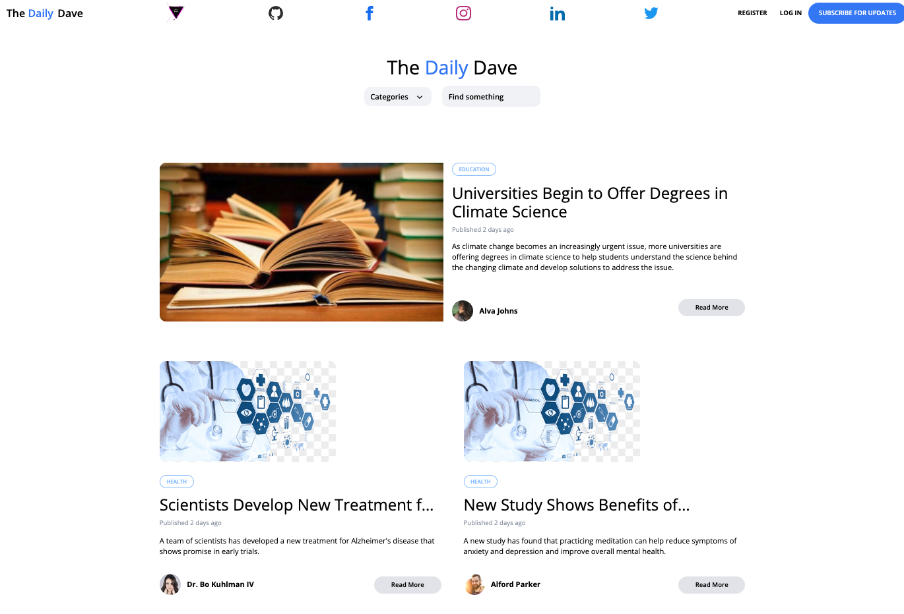
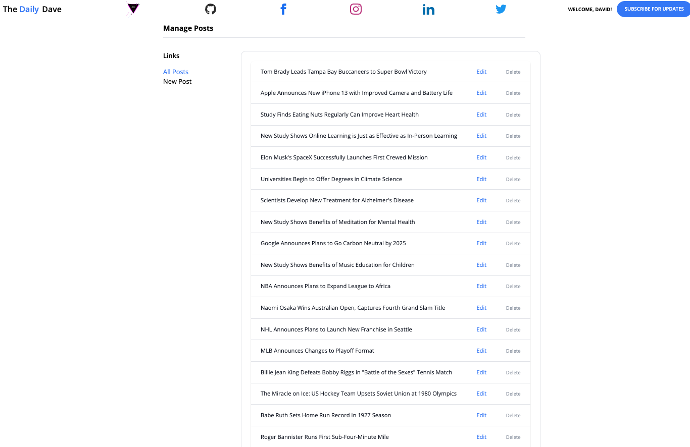

# The Daily Dave

The Daily Dave is a replicated news website designed to showcase the developer's skills using Laravel, PHP, Tailwind, and Blade. It's a fully functional website that allows users to browse and read articles on various categories such as sports, education, health, technology, and entertainment. Users can also comment on these articles after logging in.

## Features

-   Browse articles by category
-   Read full articles by clicking "Read More"
-   Comment on articles after logging in
-   Admin features to create, edit, and delete posts
-   Responsive design using Tailwind CSS

## Getting Started

To get started with The Daily Dave, you can clone the repository and install the required dependencies using the following commands:

git clone https://github.com/davebenner14/TheDailyDave.git
cd TheDailyDave
composer install
npm install && npm run dev

After installing the dependencies, you can create a new database and configure the `.env` file with your database credentials. Once configured, you can run the following commands to migrate the database and seed it with some sample data:

php artisan migrate --seed

Finally, you can start the local development server using the following command:

php artisan serve

## Screenshots

## Note

The subscribe feature of this project does not include an API. To access the website, please [click here for website](#) -> Currently having issues deploying website, please check back soon.

Thank you for your interest in The Daily Dave!
